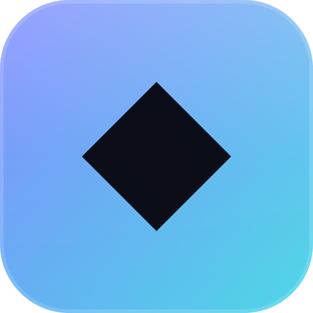
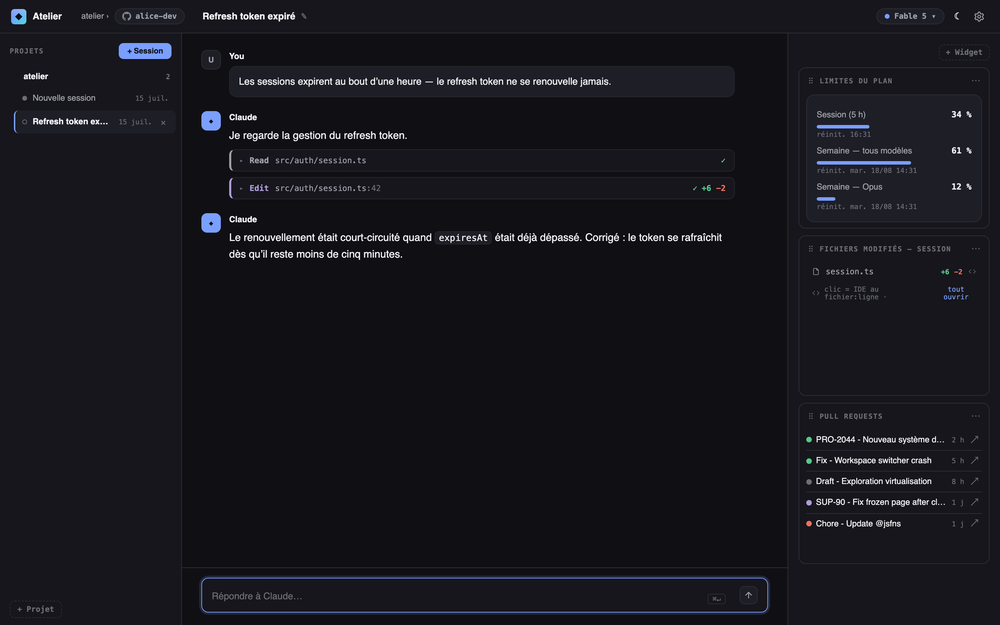
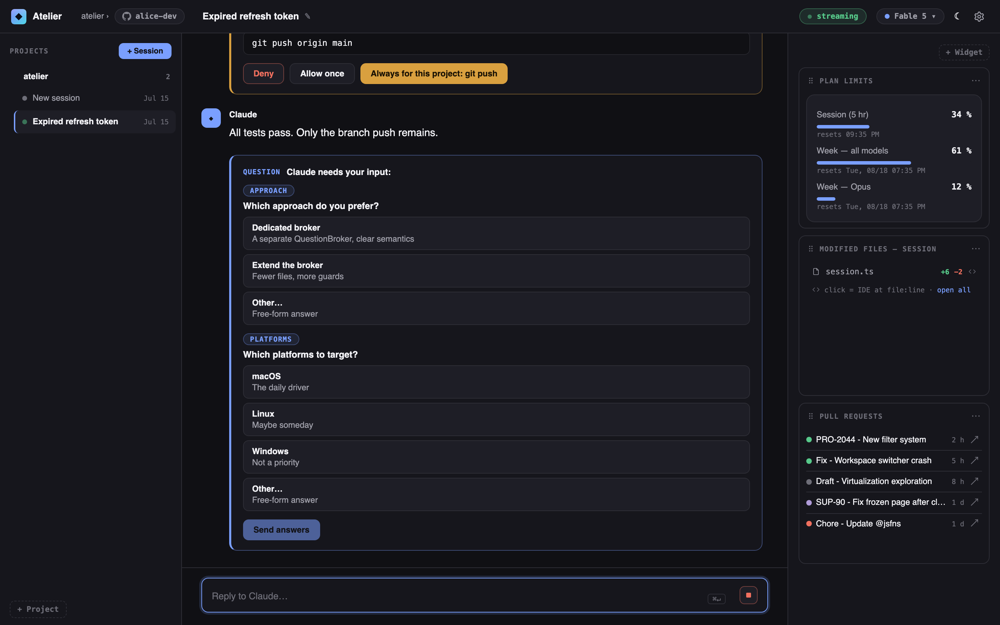
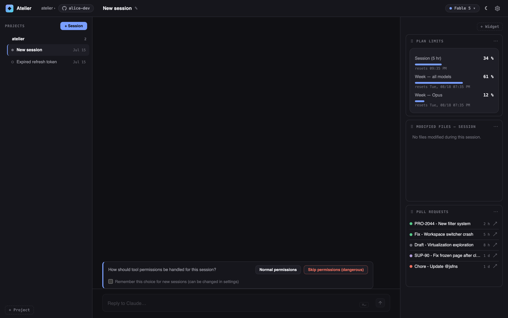
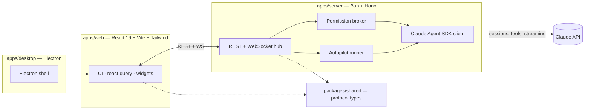

<p align="center">
  
</p>

<h1 align="center">Atelier</h1>

<p align="center">
  A local-first workbench for <a href="https://platform.claude.com/docs/en/api/agent-sdk/overview">Claude Agent SDK</a> sessions —
  chat with coding agents, gate their tool calls, and keep an eye on your projects from one dashboard.
</p>

<p align="center">
  <a href="https://github.com/g-grum/atelier/actions/workflows/ci.yml"></a>
  <a href="LICENSE"></a>
</p>

<p align="center">
  
</p>

## What is it?

Atelier is a desktop + web UI built on top of the **Claude Agent SDK**. It runs entirely on your machine: a Bun server drives real agent sessions against your local repositories, and a React front end (also packaged as an Electron app) gives you a workspace to steer them.

**Highlights**

- **Streaming chat sessions** per project, with Markdown rendering, tool-call timelines (`Read`, `Edit` with diff stats, `Bash`…) and session resume.
- **Permission broker** — every sensitive tool call (e.g. `git push`) is intercepted and surfaced in the UI: refuse, allow once, or always-allow per project.
- **Interactive questions** — when the agent needs a decision, it renders as a structured form (single/multi choice + free text), not a wall of text.
- **Dashboard widgets** — plan usage limits, files modified during the session (click to open in your IDE), GitHub pull requests for any repo you configure.
- **Autopilot** — point it at a backlog and it runs items autonomously in sequence: bounded loop, one retry, timeout, cleanup, and a PR per item.
- **Composer power-ups** — `@` file mentions with autocompletion, image paste/drag-and-drop upload, slash-command discovery, model selector.
- **Local-first** — your code never leaves your machine except through the Anthropic API calls the SDK makes.

> UI copy is currently in French — English localization is on the roadmap.

## Screenshots

| Session with tool calls | Permissions & questions |
|---|---|
|  |  |



## Architecture

Bun workspace monorepo, protocol-first: the front end and server share one typed protocol package and communicate over REST + WebSocket.



- **`apps/server`** — Hono routes + a WebSocket hub streaming SDK events (messages, tool calls, permission requests) to the UI. Wraps `@anthropic-ai/claude-agent-sdk` behind a small `SdkClient` seam so the whole app is testable against a fake.
- **`apps/web`** — React 19, Vite, Tailwind 4, TanStack Query. Ships a fixtures mode (`VITE_USE_FIXTURES=1`) that replays an in-memory demo backend — the screenshots above are that mode.
- **`apps/desktop`** — thin Electron shell embedding the built web app and spawning the server.
- **`packages/shared`** — the single source of truth for protocol types, validated at the boundaries.

Tests: 780+ across 64 files (`bun test`), TDD throughout.

## Getting started

Requirements: [Bun](https://bun.sh) ≥ 1.2, a [Claude Code](https://claude.com/product/claude-code)-authenticated environment (the SDK reuses your local credentials), macOS or Linux.

```bash
git clone https://github.com/g-grum/atelier.git
cd atelier
bun install

# 1. Start the server (port 4517)
bun run dev:server

# 2. Start the web UI (port 4518)
bun run dev:web

# — or try it with zero setup, no API calls, using demo fixtures:
VITE_USE_FIXTURES=1 bun run dev:web
```

Desktop app:

```bash
bun run dev:desktop     # build web + launch Electron
bun run package:mac     # package a macOS .app
```

## License

[MIT](LICENSE) © Germain Grumel
